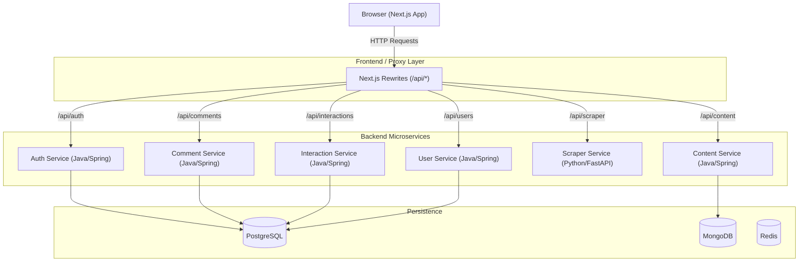
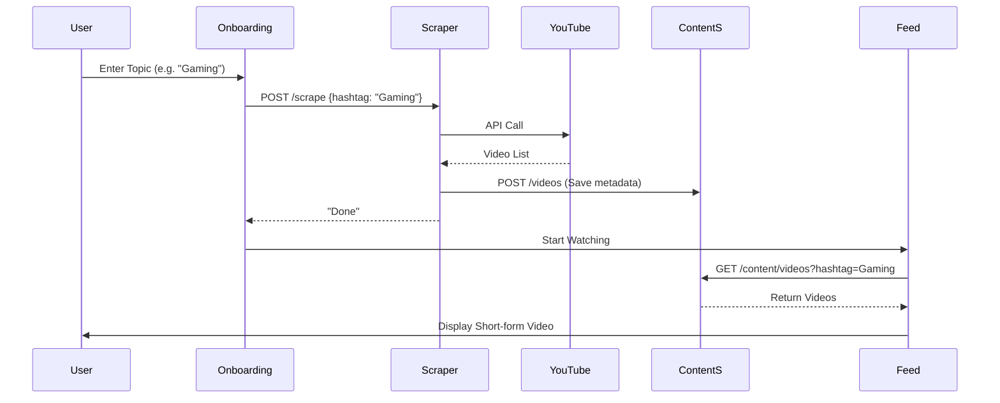

# RealStream System Design & Integration Map

This document explains the architecture of the RealStream application, detailing how the frontend and backend interact, and identifies the roles of each service.

## High-Level System Design (HLD)

The system follows a microservices architecture with a Next.js frontend acting as both a client and a reverse-proxy (via Rewrites).

## Low-Level System Design (LLD)

### Integration Map: Component to Service

| Frontend Component | Backend Service | API Endpoint | Purpose |
| :--- | :--- | :--- | :--- |
| **AuthContext** | `auth-service` | `GET /auth/user/me` | Validates JWT and retrieves Google profile data. |
| **Onboarding** | `scraper-service` | `POST /scrape` | Triggers YouTube scraping for a specific topic/channel. |
| **Video Feed** | `content-service` | `GET /content/videos` | Fetches paginated video metadata (YouTube IDs, Titles). |
| **VideoPlayer** | YouTube Embeds | `iframe` | Plays the actual video content directly from YouTube. |
| **ActionBar** | `interaction-service` | `POST /interactions/likes` | Toggles like status for the video. |
| **ActionBar** | `interaction-service` | `GET /interactions/likes` | Retrieves like count and user's liked status. |
| **CommentDrawer** | `comment-service` | `GET /comments` | Fetches all comments for a specific video. |
| **CommentDrawer** | `comment-service` | `POST /comments` | Adds a new user comment. |
| **UserProfile** | `auth-service` | `GET /auth/user/me` | Displays the logged-in user's details. |

## Service Status & Interaction Verification

### Useful & Active Services
- **`scraper-service`**: **CRITICAL**. It is the gateway to new content. Without it, the search functionality in `Onboarding.tsx` wouldn't work. It populates the `content-service` database.
- **`content-service`**: **CRITICAL**. Serves as the primary data source for the infinite scroll feed.
- **`auth-service`**: **ACTIVE**. Handles Google OAuth2 flow and provides user state to the entire frontend via `AuthContext`.
- **`comment-service`**: **ACTIVE**. Powers the interactive social layer in `CommentDrawer`.
- **`interaction-service`**: **ACTIVE**. Handles likes, which are the primary user engagement metric.

### Redundant / Unused Services
- **`user-service`**: **REDUNDANT**. 
    - **Reasoning**: While it exists and has endpoints for profile management (`/users/me`), the frontend currently relies solely on the `auth-service` for user identity. The `UserProfile` component uses the user object from `AuthContext` rather than calling the `user-service`.
    - **Recommendation**: Either integrate `/users/me` into the `UserProfile` component for persistent "Bio" and "Followed Hashtags" or decommission it if those features aren't prioritized.

## Data Flow Diagram

The following flow describes the search-to-watch pipeline:

