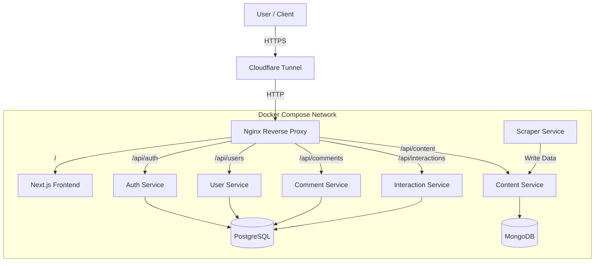

# RealStream 🎬

**RealStream** is a modern, high-performance video streaming platform built with a robust microservices architecture. It is designed to provide a focused, distraction-free environment where users can consume short-form content with full control.

## 🎯 Project Motto & Goals

### For the User
> **"Watch with Focus, Control with Ease."**

The primary goal of RealStream is to combat the chaotic, algorithm-driven distraction common in modern social media. We aim to empower users to watch content on their own terms, remaining focused and undisturbed by intrusive features.

### For the Developer
This project serves as a comprehensive showcase of enterprise-grade backend development. The personal goal was to master the **Spring Boot** ecosystem by implementing a complex, real-world application from scratch. It demonstrates deep knowledge of:
*   Microservices Architecture
*   Secure Authentication (OAuth2/JWT)
*   Polyglot Persistence (SQL & NoSQL)
*   Container Orchestration (Docker)

---

## 🏗️ Architecture

RealStream leverages a distributed system design to ensure scalability, maintainability, and fault tolerance.



### 🔹 Frontend Services
**Tech Stack:** Next.js 14, TypeScript, TailwindCSS, React Query, Framer Motion.

The frontend is the user's window into the platform. It is a **Server-Side Rendered (SSR)** React application that provides:
*   **Video Player**: Adaptive streaming with custom controls 📹
*   **Infinite Scrolling**: Seamless content discovery.
*   **Real-time Interactions**: Immediate updates for likes and comments using React Query with optimistic updates.
*   **Responsive Design**: A mobile-first approach ensuring a professional experience on all devices.

**Significance:** It decouples the UI from the backend logic, allowing independent scaling and faster iteration on the user experience.

### 🔹 Backend Services
**Tech Stack:** Java, Spring Boot 3, Spring Data JPA/Mongo, Spring Security.

The backend is composed of specialized microservices, each responsible for a specific domain:

1.  **Auth Service**: Handles OAuth2 authentication (Google), JWT generation, and session management.
2.  **User Service**: Manages user profiles, preferences, and account data.
3.  **Content Service**: Manages video metadata, URLs, and thumbnails. Stores data in **MongoDB** to handle flexible content structures efficiently.
4.  **Comment Service**: Handles video comments, threading, and retrieval. Uses **PostgreSQL** for relational integrity.
5.  **Interaction Service**: Tracks likes, views, and watch history.
6.  **Scraper Service (Python)**: An autonomous service that populates the platform with initial content from external sources.

**Design:** Services communicate via REST APIs. They are stateless and containerized, making them easy to deploy and scale.

---

## 🔹 Technology Stack & Rationale

| Layer | Technology | Reason for Choice |
| :--- | :--- | :--- |
| **Frontend** | **Next.js** | Best-in-class SSR and SEO capabilities. Fast initial page load. |
| | **TailwindCSS** | Rapid UI development with utility-first classes. Consistent design system. |
| | **React Query** | Powerful server-state management. Handles caching, deduping, and background updates effortlessly. |
| **Backend** | **Spring Boot** | Enterprise-grade framework. Robust dependency injection and huge ecosystem. |
| **Database** | **PostgreSQL** | Reliable relational database for structured data (Users, Comments, Auth). |
| | **MongoDB** | NoSQL database for flexible content schemas (Video Metadata). |
| **Infrastructure** | **Docker Compose** | Orchestrates the multi-container environment locally and in production. |
| | **Nginx** | High-performance reverse proxy. Handles routing, SSL, and load balancing. |
| | **Cloudflare Tunnel**| Securely exposes the local environment to the public internet without opening ports. |

---

## 🔹 How It Works

1.  **User Access**: The user visits the public Cloudflare URL.
2.  **Routing**: The request hits the **Cloudflare Tunnel**, which forwards it securely to the local **Nginx** instance.
3.  **Page Load**: Nginx routes the root request (`/`) to the **Next.js Frontend** container, which renders the initial HTML.
4.  **Data Fetching**: The frontend makes API calls (e.g., `/api/videos`) which Nginx routes to the appropriate backend service (e.g., `content-service`).
5.  **Data Retrieval**: The backend service queries the database (Postgres or Mongo) and returns JSON data.
6.  **Rendering**: The frontend hydrates the page with the data, displaying videos, comments, and profile info 🎞️

---

## 🔹 Deployment

The application is currently deployed using a **"Zero Cost" Local Hosting Strategy**:

*   **Hosting**: Your local machine acts as the server.
*   **Containerization**: `docker-compose.prod.yml` runs all 8 services (Frontend, 5 Backend Services, 2 Databases, Nginx) in isolated containers.
*   **Exposure**: `cloudflared` creates a secure tunnel from your machine to the internet.

### How to Access
Visit the URL generated by the startup script.

---

## 🔹 Getting Started

### Prerequisites
*   Docker Desktop installed and running.
*   A Google Cloud Project (for OAuth credentials).

### Running the App
1.  **Start Everything**:
    ```bash
    ./start_live.sh
    ```
    This script will:
    *   Build and start all Docker containers.
    *   Start the Cloudflare Tunnel.
    *   Display your public URL.

2.  **Stop Everything**:
    ```bash
    ./stop_live.sh
    ```

---