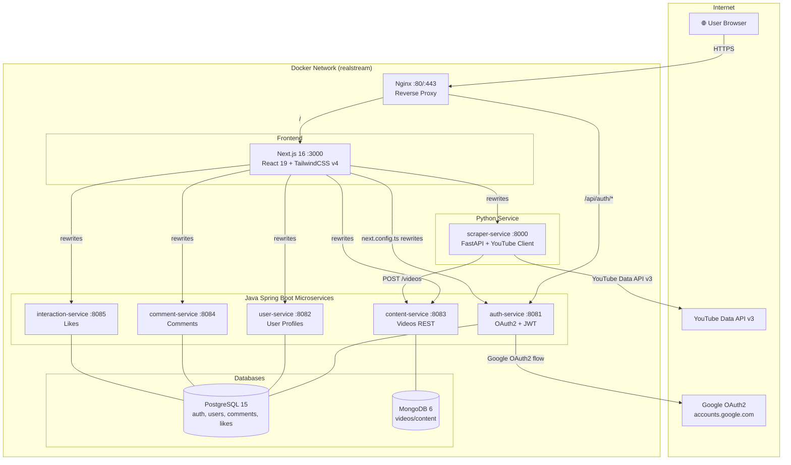
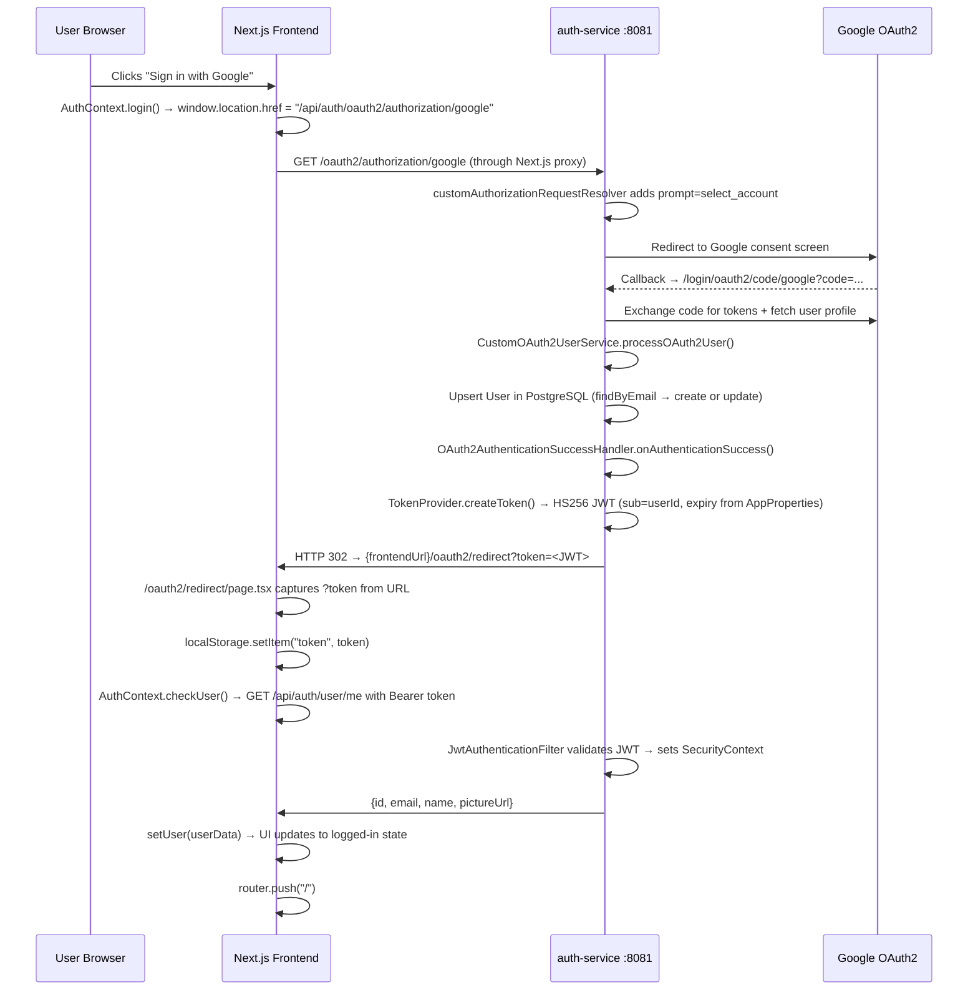
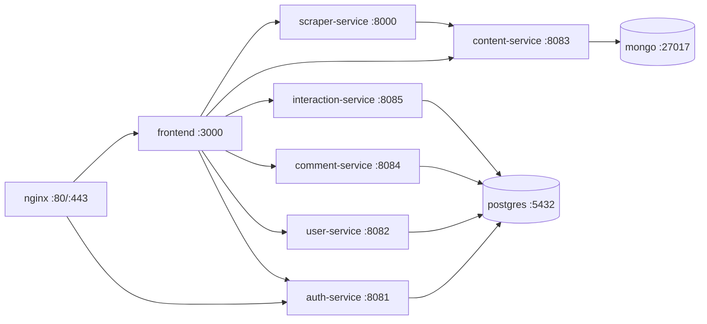

# RealStream — Complete Low-Level Architecture Documentation

> **Deep-dive technical reference** — covers every binding point, data flow, design decision, and coding standard used across the entire project.

---

## Table of Contents

1. [System Overview](#1-system-overview)
2. [High-Level Architecture Diagram](#2-high-level-architecture-diagram)
3. [Microservices Inventory](#3-microservices-inventory)
4. [Service Binding & Proxy Routing](#4-service-binding--proxy-routing)
5. [Authentication — Google OAuth2 + JWT (Deep Dive)](#5-authentication--google-oauth2--jwt-deep-dive)
6. [Content Pipeline — Scraper → Storage → Feed](#6-content-pipeline--scraper--storage--feed)
7. [Frontend Architecture](#7-frontend-architecture)
8. [Database Design](#8-database-design)
9. [Docker Compose Deployment Model](#9-docker-compose-deployment-model)
10. [Coding Standards & Low-Level Design Principles](#10-coding-standards--low-level-design-principles)
11. [Component Interaction Map](#11-component-interaction-map)
12. [How Video Streaming Works](#12-how-video-streaming-works)
13. [Concurrency & Multithreading Model](#13-concurrency--multithreading-model)
14. [Environment Variable Management & Security](#14-environment-variable-management--security)
15. [Database Choice Rationale — PostgreSQL vs MongoDB](#15-database-choice-rationale--postgresql-vs-mongodb)
16. [Production Database Access Guide](#16-production-database-access-guide)

---

## 1. System Overview

**RealStream** is a short-form video streaming platform inspired by TikTok/YouTube Shorts. It follows a **polyglot microservices architecture** where each concern is isolated into a dedicated service:

| Concern | Technology |
|---|---|
| Frontend SPA | **Next.js 16** + **React 19** + **TypeScript** |
| Authentication | **Java 21** / Spring Boot 3 + OAuth2 + JWT |
| User Profiles | **Java 21** / Spring Boot 3 |
| Content (Videos) | **Java 21** / Spring Boot 3 + MongoDB |
| Comments | **Java 21** / Spring Boot 3 + PostgreSQL |
| Interactions (Likes) | **Java 21** / Spring Boot 3 + PostgreSQL |
| Video Scraping | **Python 3** / FastAPI + YouTube Data API v3 |
| Reverse Proxy / Gateway | **Nginx** |
| Datastores | **PostgreSQL 15** (relational) + **MongoDB 6** (documents) |
| Containerization | **Docker Compose** |
| Tunnel / Custom Domain | **Cloudflare Tunnel** → `realstream.site` |

---

## 2. High-Level Architecture Diagram



---

## 3. Microservices Inventory

### 3.1 auth-service (`:8081`)

**Language:** Java 21 · **Framework:** Spring Boot 3.x  
**Package root:** `com.realstream.auth`

| Class | Role |
|---|---|
| `SecurityConfig` | Central Spring Security filter chain — wires CORS, CSRF-off, session policy, OAuth2 login, JWT filter |
| `CustomOAuth2UserService` | Extension of `DefaultOAuth2UserService`; upserts users from Google profile on first login |
| `OAuth2AuthenticationSuccessHandler` | After successful Google login, mints a JWT and redirects to frontend `/oauth2/redirect?token=...` |
| `TokenProvider` | Issues and validates HS256 JWTs using JJWT 0.11.5; expiry and secret from `AppProperties` |
| `JwtAuthenticationFilter` | `OncePerRequestFilter` — reads `Authorization: Bearer <token>`, validates, sets `SecurityContextHolder` |
| `UserPrincipal` | `OAuth2User` adapter that bridges Spring Security principal with auth `User` entity |
| `AuthController` | `GET /user/me` — returns `{id, email, name, pictureUrl}` for authenticated user |
| `UserRepository` | `JpaRepository<User, UUID>` — `findByEmail`, `findById` |
| `User` (model) | `id (UUID) · email · fullName · imageUrl · provider (GOOGLE) · role (USER)` |

**Key dependencies (pom.xml):**
- `spring-boot-starter-security`
- `spring-boot-starter-oauth2-client`
- `spring-boot-starter-data-jpa`
- `jjwt-api / jjwt-impl / jjwt-jackson` (v0.11.5)
- `postgresql` (runtime)
- `lombok`

---

### 3.2 user-service (`:8082`)

**Language:** Java 21 · **Package root:** `com.realstream.user`

| Class | Role |
|---|---|
| `UserProfileController` | `GET /me`, `PUT /me`, `GET /{userId}` — identity passed via `X-User-Id` header |
| `UserProfileService` | Business logic: `getOrCreateProfile(UUID)`, `updateProfile(UUID, dto)` |
| `UserProfile` (model) | Extended profile separate from auth `User` — bio, avatar, etc. |
| `UserProfileRepository` | JPA repo keyed on `userId (UUID)` |

> **Design principle:** Auth identity (`User`) is owned by `auth-service`; extended profile (`UserProfile`) is owned by `user-service`. Services share only the `userId` UUID as a contract, never a foreign-key dependency across databases.

---

### 3.3 content-service (`:8083`)

**Language:** Java 21 · **Package root:** `com.realstream.content`  
**Database:** MongoDB (`realstream_content` database)

| Class | Role |
|---|---|
| `VideoController` | `POST /videos` (upsert), `GET /videos` (paginated, filter by hashtag/channel), `GET /videos/{id}` |
| `Video` (model) | `id · videoId (YouTube ID) · title · description · url · hashtags[] · thumbnailUrl · channelTitle · duration · viewCount` |
| `VideoRepository` | `MongoRepository<Video, String>` — custom: `findByHashtagsIn`, `findByChannelTitle`, pageable |

**Pagination Design:** Uses Spring Data's `Pageable` (page/size) returning a Spring `Page<Video>`. Frontend maps this to its own `Page<T>` interface.

---

### 3.4 comment-service (`:8084`)

**Language:** Java 21 · **Package root:** `com.realstream.comment`  
**Database:** PostgreSQL

| Endpoint | Method | Identity | Description |
|---|---|---|---|
| `/` (mapped to `/comments`) | `POST` | `X-User-Id` header | Create comment |
| `/comments` (query `?videoId=`) | `GET` | — | List comments for video (desc by date) |
| `/comments/count` | `GET` | — | Count for a videoId |
| `/comments/{id}` | `DELETE` | `X-User-Id` header | Delete own comment |

**Model:** `id (UUID) · userId (UUID) · videoId (String) · content · createdAt`  
Uses Lombok `@Builder` for clean object construction.

---

### 3.5 interaction-service (`:8085`)

**Language:** Java 21 · **Package root:** `com.realstream.interaction`  
**Database:** PostgreSQL

**Toggle-Like Pattern:**
```java
// Idempotent toggle — no separate like/unlike endpoints
@PostMapping("/likes/{videoId}")
@Transactional
public ResponseEntity<LikeStatus> toggleLike(UUID userId, String videoId) {
    boolean exists = likeRepository.existsByUserIdAndVideoId(userId, videoId);
    if (exists) likeRepository.deleteByUserIdAndVideoId(userId, videoId);
    else        likeRepository.save(Like.builder().userId(userId).videoId(videoId).build());
    return ResponseEntity.ok(LikeStatus.builder()
        .isLiked(!exists)
        .likeCount(likeRepository.countByVideoId(videoId))
        .build());
}
```

**LikeStatus DTO:** `{ isLiked: boolean, likeCount: long }` — returned from both GET and POST.

---

### 3.6 scraper-service (`:8000`)

**Language:** Python 3 · **Framework:** FastAPI  
**Files:** `main.py`, `youtube_client.py`, `requirements.txt`

**`YouTubeClient`** wraps `google-api-python-client`:
- `search_videos(query, limit)` — biases toward Shorts by appending `"shorts"` to query + `videoDuration=short`
- `get_channel_videos(channel_name, limit)` — resolves channel handle → channel ID first, then fetches latest short videos
- `_map_video_data(item, source_query)` — normalizes YouTube API response to internal `Video` format

**Scrape Pipeline:**
```
POST /scrape { hashtag?, channel?, limit }
    ├── YouTubeClient.search_videos() OR get_channel_videos()
    └── For each result → POST http://content-service:8083/videos
            └── Returns { message, count, saved_count, videos[] }
```

**CONTENT_SERVICE_URL env var** resolves Docker hostname `content-service:8083` in prod, `localhost:8083` in dev.

---

## 4. Service Binding & Proxy Routing

### 4.1 Next.js Reverse Proxy (Dev + Docker Internal)

`next.config.ts` rewrites all `/api/*` paths to internal Docker hostnames. This is the **single source of truth** for frontend→backend routing:

```typescript
// next.config.ts
rewrites() {
  return [
    { source: "/api/auth/:path*",         destination: "http://auth-service:8081/auth/:path*" },
    { source: "/api/users/:path*",        destination: "http://user-service:8082/users/:path*" },
    { source: "/api/videos/:path*",       destination: "http://content-service:8083/:path*" },
    { source: "/api/comments/:path*",     destination: "http://comment-service:8084/comments/:path*" },
    { source: "/api/interactions/:path*", destination: "http://interaction-service:8085/interactions/:path*" },
    { source: "/api/scraper/:path*",      destination: "http://scraper-service:8000/:path*" },
  ];
}
```

> **Why this matters:** The frontend only ever calls `/api/*`. Whether running locally or in Docker, Next.js transparently proxies to the correct backend. No CORS issues, no hardcoded backend URLs in client code.

### 4.2 Frontend API Client Binding (`lib/api.ts`)

All HTTP calls go through a single Axios instance:

```typescript
const api = axios.create({ baseURL: "/api" });

// Request interceptor — auto-injects JWT
api.interceptors.request.use((config) => {
    const token = localStorage.getItem("token");
    if (token) config.headers.Authorization = `Bearer ${token}`;
    return config;
});
```

**`X-User-Id` Header Pattern:**  
For comment and interaction services, the user ID is extracted client-side by decoding the JWT payload (not a network round-trip):
```typescript
function getUserId(): string {
    const token = localStorage.getItem("token");
    const payload = JSON.parse(atob(token.split(".")[1]));
    return payload.sub; // JWT subject = user UUID
}
// Then passed as: headers: { "X-User-Id": userId }
```

> This means **auth-service is not involved in every secured request** — the JWT is self-contained. Other services trust the `X-User-Id` header (a common microservice pattern for internal trust boundaries).

### 4.3 CORS Configuration

`SecurityConfig.corsConfigurationSource()` allows:
- `http://localhost:3000` (local dev)
- `http://localhost:80` (Docker local)
- `${app.oauth2.frontend-url}` (env-configured production URL, e.g., `https://realstream.site`)

`allowCredentials: true` is required for session cookies used during the OAuth2 handshake.

---

## 5. Authentication — Google OAuth2 + JWT (Deep Dive)

### Complete OAuth2 Flow



### Session Strategy

`SessionCreationPolicy.ALWAYS` is set in `SecurityConfig`. This keeps an HTTP session alive on the auth service **only during the OAuth2 handshake** (Google requires state param persistence). Once the JWT is issued, all subsequent requests are **stateless** — only the JWT matters.

### JWT Structure

| Field | Value |
|---|---|
| Algorithm | HS256 |
| Library | JJWT 0.11.5 |
| Subject (`sub`) | `userId` (UUID string) |
| Expiry | Configured via `app.auth.tokenExpirationMsec` (AppProperties) |
| Secret | Base64-encoded secret in `app.auth.tokenSecret` (AppProperties) |

### Security Filter Chain Order

```
Request → JwtAuthenticationFilter (OncePerRequestFilter)
              ↓ if valid JWT
         Sets SecurityContextHolder authentication
              ↓
         UsernamePasswordAuthenticationFilter (Spring default, skipped for OAuth2)
              ↓
         Controller endpoint
```

Public endpoints (`/`, `/login**`, `/error**`, `/oauth2/**`) bypass authentication. All others require a valid JWT.

---

## 6. Content Pipeline — Scraper → Storage → Feed

```
User enters topic/channel on Onboarding screen
    ↓
page.tsx: useMutation → scraperService.scrape(topic, channel)
    ↓
POST /api/scraper/scrape → [Next.js proxy] → scraper-service:8000/scrape
    ↓
YouTubeClient:
  - search_videos(query + "shorts", limit=10, videoDuration=short)
  OR
  - get_channel_videos(channel) → resolve channelId → fetch latest shorts
    ↓
For each video found:
  POST http://content-service:8083/videos (upsert by videoId)
    ↓
content-service saves to MongoDB (realstream_content)
    ↓
Mutation onSuccess → queryClient.invalidateQueries(["videos"])
    ↓
useInfiniteQuery re-fetches → GET /api/content/videos?hashtag=...&page=0
    ↓
VideoPlayer renders YouTube iframe embed:
  https://www.youtube.com/embed/{videoId}?autoplay=1&loop=1&mute=0...
```

**Infinite Scroll Implementation:**
```typescript
// page.tsx — scroll event on the feed container
const handleScroll = (e) => {
    const { scrollTop, clientHeight, scrollHeight } = e.currentTarget;
    const index = Math.round(scrollTop / clientHeight); // snap-based index
    setActiveIndex(index); // drives which VideoPlayer is "isActive"
    
    // Load next page when within 1.5x viewport height of bottom
    if (scrollHeight - scrollTop <= clientHeight * 1.5) {
        if (hasNextPage && !isFetchingNextPage) fetchNextPage();
    }
};
```

**VideoPlayer lazy loading:** `isActive` prop controls a 300ms timeout before mounting the YouTube iframe, allowing CSS scroll-snap to settle visually before loading the embed.

---

## 7. Frontend Architecture

### 7.1 Tech Stack

| Technology | Version | Purpose |
|---|---|---|
| **Next.js** | 16.1.6 | App Router, SSR/SSG, API rewrites, image optimization |
| **React** | 19.2.3 | Latest concurrent features, RSC support |
| **TypeScript** | 5.x | Type safety across all components and API interfaces |
| **TailwindCSS** | 4.x | Utility-first CSS with `@theme` custom tokens (new v4 API) |
| **TanStack Query** | 5.x | Server state management, infinite queries, mutations, cache invalidation |
| **Axios** | 1.13.5 | HTTP client with request interceptors for auth headers |
| **Framer Motion** | 12.x | Physics-based animations, spring transitions |
| **Lucide React** | 0.563.0 | Icon system |
| **Radix UI** | Slot primitive | Accessible, unstyled UI primitives |
| **clsx / tailwind-merge** | Latest | Conditional class composition |

### 7.2 Application Structure

```
frontend/src/
├── app/
│   ├── layout.tsx          ← Root layout: Inter font, RetroGrid bg, Providers wrapper
│   ├── page.tsx            ← Main app shell — all state logic lives here
│   ├── globals.css         ← Design system: CSS custom properties, TailwindCSS v4 @theme
│   └── oauth2/
│       └── redirect/
│           └── page.tsx    ← OAuth2 callback handler — captures ?token, stores to localStorage
├── components/
│   ├── Header.tsx          ← Top nav: logo, topic label, auth buttons
│   ├── Onboarding.tsx      ← Search/topic entry screen (initial state)
│   ├── VideoPlayer.tsx     ← YouTube iframe with poster fallback + lazy mount
│   ├── ActionBar.tsx       ← Like/Comment/Share vertical button rail
│   ├── VideoMetadata.tsx   ← Channel name, caption, hashtags overlay
│   ├── CommentDrawer.tsx   ← Slide-up comment panel
│   ├── LoginModal.tsx      ← Login prompt modal
│   ├── UserProfile.tsx     ← Profile slide panel
│   ├── Providers.tsx       ← QueryClientProvider + AuthProvider tree
│   └── ui/
│       └── retro-grid.tsx  ← Animated SVG grid background
├── context/
│   └── AuthContext.tsx     ← Global auth state: user, login(), logout(), checkUser()
└── lib/
    ├── api.ts              ← All service clients: videoService, interactionService, commentService, scraperService, userService
    └── utils.ts            ← Utility helpers (clsx/twMerge)
```

### 7.3 State Management Architecture

**Provider tree (set up in `Providers.tsx`):**
```
<QueryClientProvider>          ← TanStack Query cache (staleTime: 60s)
  <AuthProvider>               ← Global auth state via React Context
    {children}                 ← Page components
  </AuthProvider>
</QueryClientProvider>
```

**State classification:**

| State Type | How Managed |
|---|---|
| Server / async (videos, comments, likes) | TanStack Query (`useInfiniteQuery`, `useMutation`) |
| Global auth | React Context (`AuthContext`) |
| Session persistence (onboarded, topic, channel) | `sessionStorage` (survives page refresh within session) |
| JWT token | `localStorage` |
| UI state (modals, active index) | Local `useState` |

### 7.4 Design System

**Tailwind v4 `@theme` (in `globals.css`):**
```css
@theme {
  --color-primary: #257bf4;           /* Brand blue */
  --color-neon-cyan: #257bf4;         /* Alias */
  --color-neon-magenta: #FF0050;      /* Accent red (TikTok-inspired) */
  --color-surface: #101722;           /* Dark card background */
  --color-background-dark: #101722;   /* Page background */
  --font-inter: var(--font-inter);    /* Google Inter font */
}
```

**Custom CSS components:**
- `.glass-panel` — `background: rgba(34, 50, 73, 0.4)` + `backdrop-filter: blur(12px)` + inner highlight border
- `.rainbow-glow` — conic gradient blur for accent effects
- `.no-scrollbar` — hides scroll chrome on the video feed
- `.animate-grid` — 15s CSS translate animation for the retro grid background
- `RetroGrid` component — animated SVG line grid creating a cyberpunk depth effect

**Typography:** `Inter` loaded via `next/font/google` (subsetting Latin, display: swap). `Material Symbols Outlined` loaded via `<link>` for icon variants.

---

## 8. Database Design

### PostgreSQL — Relational Schema (auth, user, comment, interaction services)

```
auth DB schema (auth-service):
┌──────────────────────────────────────┐
│ users                                │
│  id          UUID  PK                │
│  email       TEXT  UNIQUE NOT NULL   │
│  full_name   TEXT                    │
│  image_url   TEXT                    │
│  provider    ENUM (GOOGLE)           │
│  provider_id TEXT                    │
│  role        ENUM (USER, ADMIN)      │
└──────────────────────────────────────┘

user-service schema:
┌──────────────────────────────────────┐
│ user_profiles                        │
│  id          UUID  PK (= auth userId)│
│  bio         TEXT                    │
│  avatar_url  TEXT                    │
│  [other profile fields]              │
└──────────────────────────────────────┘

comment-service schema:
┌──────────────────────────────────────┐
│ comments                             │
│  id          UUID  PK                │
│  user_id     UUID  (FK by convention)│
│  video_id    TEXT  (MongoDB _id)     │
│  content     TEXT                    │
│  created_at  TIMESTAMP               │
└──────────────────────────────────────┘

interaction-service schema:
┌──────────────────────────────────────┐
│ likes                                │
│  id          UUID  PK                │
│  user_id     UUID                    │
│  video_id    TEXT                    │
│  UNIQUE(user_id, video_id)           │
└──────────────────────────────────────┘
```

### MongoDB — Document Schema (content-service)

```json
// realstream_content.videos
{
  "_id": "<ObjectId>",
  "videoId": "dQw4w9WgXcY",         // YouTube video ID (unique)
  "title": "This video title",
  "description": "...",
  "url": "https://youtube.com/shorts/...",
  "hashtags": ["#trending", "#music"], // Array field → indexed for findByHashtagsIn
  "thumbnailUrl": "https://i.ytimg.com/...",
  "channelTitle": "MrBeast",
  "duration": 60,
  "viewCount": 0
}
```

**Why MongoDB for content?** Videos are schema-flexible (hashtags are a variable-length array), and `findByHashtagsIn` with pagination is a natural MongoDB use case. PostgreSQL's array support is feasible but MongoDB's document model is a better fit.

---

## 9. Docker Compose Deployment Model

**File:** `docker-compose.prod.yml`



**Service startup order (depends_on):**
1. `postgres` (healthcheck: `pg_isready`)
2. `auth-service`, `user-service`, `comment-service`, `interaction-service` (after postgres healthy)
3. `mongo`
4. `content-service` (after mongo)
5. `scraper-service` (after content-service)
6. `frontend` (after auth-service, content-service)
7. `nginx` (after frontend, auth-service)

**Environment variables surfaced via `.env`:**

| Variable | Consumed By |
|---|---|
| `POSTGRES_USER / PASSWORD` | All Spring Boot JPA services |
| `GOOGLE_CLIENT_ID / SECRET` | auth-service |
| `FRONTEND_URL` | auth-service (`APP_OAUTH2_FRONTEND_URL`) |
| `YOUTUBE_API_KEY` | scraper-service |

**Build contexts:** Each Java service Dockerfile is at `./backend/<service>/Dockerfile` with context `./backend` (parent dir) so Maven multi-module build works. Scraper uses its own directory context.

---

## 10. Coding Standards & Low-Level Design Principles

### 10.1 Java Services — Standards Applied

**Lombok for boilerplate elimination:**
```java
@RequiredArgsConstructor   // Constructor injection (no @Autowired field injection)
@Slf4j                     // Auto-generates log field
@Builder                   // Builder pattern for model construction
```

**Dependency Injection via Constructor (not field):**
All services use `@RequiredArgsConstructor` + `final` fields. This is the Spring Boot best practice (immutability, testability).

**Repository-only access to data:**
Controllers never directly access data — they go through `Service` → `Repository`. (Some simple controllers go directly to Repository for CRUD-only cases, acceptable for thin services.)

**`@Transactional` on toggle operations:**
`InteractionController.toggleLike()` is annotated `@Transactional` to ensure the `existsByUserIdAndVideoId` check and the subsequent `save`/`delete` are atomic.

**Spring Data JPA Patterns:**
- All repos extend `JpaRepository<Entity, ID>` (PostgreSQL services) or `MongoRepository<Entity, ID>` (content-service)
- Custom queries derived from method names: `findByEmail`, `findByVideoIdOrderByCreatedAtDesc`, `countByVideoId`, `existsByUserIdAndVideoId`, `deleteByUserIdAndVideoId`

**UUID as primary key:**
All entities use `UUID` for primary keys — avoids integer sequence contention, globally unique across services, safe for distributed architecture.

**`X-User-Id` header trust model:**
Services behind the internal Docker network trust the `X-User-Id` header passed from the frontend (decoded from JWT client-side). This is secure because:
1. Services are not exposed outside Docker network
2. The header is set by frontend code that first validated the JWT
3. Nginx/auth-service is the SSL termination boundary

**AppProperties (`@ConfigurationProperties`):**
JWT secret and expiry are injected via `AppProperties` class (type-safe config binding), not raw `@Value` in business logic.

### 10.2 Python Service — Standards Applied

- **FastAPI** with Pydantic `BaseModel` for request validation (`ScrapeRequest`)
- **Environment isolation** with `python-dotenv` (`.env` file)
- **Class-based API client** (`YouTubeClient`) — `search_videos`, `get_channel_videos`, `_map_video_data` — clear separation of API interaction from business logic
- **Graceful failure:** Each video save is wrapped in try/except — one failure doesn't abort the entire scrape
- **`CONTENT_SERVICE_URL`** env var for service discovery (default: Docker hostname)

### 10.3 Frontend — Standards Applied

**Type safety everywhere:**
- `Video`, `Page<T>`, `LikeStatus`, `Comment` interfaces defined in `lib/api.ts`
- `AuthContextType` interface for context contract
- All component props are typed

**Server state vs. client state separation:**
- TanStack Query owns all async/server state
- React Context limits to auth state only
- `sessionStorage` for lightweight session persistence (not Redux/Zustand — YAGNI principle)

**`useInfiniteQuery` instead of manual pagination:**
Cleanly handles page accumulation, loading states, and "hasNextPage" detection from Spring's `Page.last` boolean.

**Axios interceptors for cross-cutting concerns:**
Auth headers are applied once at the Axios level — components never touch auth headers directly.

**No hardcoded backend URLs in components:**
All API calls go through `lib/api.ts` service objects. Components call `videoService.getVideos()`, not raw `axios.get(...)`. This is the **Service Layer pattern** applied to frontend.

**Tailwind v4 design tokens:**
Custom color, font, and animation tokens in `@theme {}` — no magic strings in components, always `text-primary`, `bg-surface`, `text-neon-cyan`.

---

## 11. Component Interaction Map

### Full Request Lifecycle: User Likes a Video

```
1. User clicks ❤️ on ActionBar

2. ActionBar.onLike() → handleInteractionAttempt() in page.tsx
   └── if !user → setIsLoginModalOpen(true) → STOP

3. if user authenticated:
   interactionService.toggleLike(videoId)
     └── api.post("/interactions/likes/{videoId}", {}, { headers: { "X-User-Id": userId } })
         └── axios interceptor adds: Authorization: Bearer <JWT>
         └── Next.js proxy: /api/interactions/* → http://interaction-service:8085/interactions/*

4. interaction-service:8085:
   JwtAuthenticationFilter: validates JWT from Authorization header
   InteractionController.toggleLike():
     @Transactional
     existsByUserIdAndVideoId() → false (first like)
     likeRepository.save(Like{userId, videoId})
     countByVideoId() → 1
     return LikeStatus{isLiked: true, likeCount: 1}

5. Frontend receives LikeStatus → ActionBar updates UI state ✓
```

### Full Request Lifecycle: OAuth2 Login

```
1. LoginModal → AuthContext.login()
   window.location.href = "/api/auth/oauth2/authorization/google"

2. Next.js proxy → auth-service:8081/auth/oauth2/authorization/google
   → SecurityConfig: oauth2Login configured, customAuthorizationRequestResolver adds prompt=select_account
   → redirect to Google

3. Google → user consents → callback to auth-service:8081/login/oauth2/code/google

4. auth-service:
   CustomOAuth2UserService.loadUser():
     fetchs Google user profile
     findByEmail() → not found → registerNewUser() → save to PostgreSQL
     return UserPrincipal

   OAuth2AuthenticationSuccessHandler.onAuthenticationSuccess():
     TokenProvider.createToken(authentication) → JWT
     redirect → {frontendUrl}/oauth2/redirect?token=<JWT>

5. Browser lands on /oauth2/redirect:
   page.tsx reads searchParams.get("token")
   localStorage.setItem("token", token)
   AuthContext.checkUser() → GET /api/auth/user/me
   
6. auth-service returns {id, email, name, pictureUrl}
   setUser() → React re-render → user is logged in ✓
   router.push("/")
```

---

*Generated via deep code analysis of RealStream codebase — February 2026*

---

## 12. How Video Streaming Works

> **Key insight: RealStream does NOT stream video itself.** It delegates 100% of video delivery to YouTube's global CDN infrastructure.

### What the app actually stores

MongoDB holds only **metadata** — `videoId`, `title`, `thumbnailUrl`, `channelTitle`, `hashtags`. Not a single video byte is stored or served by RealStream.

### The streaming model

```
User scrolls to a video
    ↓
VideoPlayer.tsx mounts a YouTube iframe:
  src="https://www.youtube.com/embed/{videoId}
       ?autoplay=1&loop=1&mute=0
       &controls=0       ← hides YouTube chrome (TikTok feel)
       &playsinline=1    ← plays inline on mobile (no forced fullscreen)
       &rel=0            ← no "related videos" recommendations after
       &modestbranding=1 ← minimal YouTube logo
       &playlist={id}    ← required for loop=1 to actually loop"
    ↓
YouTube's CDN delivers the video stream directly to the user's browser
RealStream's servers are NOT in the video data path at all
```

### Lazy loading — how only 1 video plays at a time

```typescript
// VideoPlayer.tsx
useEffect(() => {
    if (isActive) {
        // Wait 300ms for CSS scroll-snap to settle BEFORE loading iframe
        // Prevents loading a video you're already scrolling past
        const timer = setTimeout(() => setShowEmbed(true), 300);
        return () => clearTimeout(timer);
    } else {
        setShowEmbed(false);  // DESTROY iframe when scrolled away → frees memory + bandwidth
    }
}, [isActive]);
```

- `isActive` is driven by `activeIndex` state in `page.tsx`, which is updated on every scroll event
- At any moment there is at most **1 active iframe** in the DOM
- Scrolling away from a video **immediately tears down the player** — no background autoplay

### Before the iframe loads — poster image

While the iframe isn't mounted yet, the component shows the `thumbnailUrl` (a static image from YouTube's CDN) with a play button overlay. This gives instant visual feedback with zero load time.

### Why this approach is production-quality

| Concern | How it's handled |
|---|---|
| Bandwidth cost | Zero — YouTube CDN pays for all video delivery |
| Latency | YouTube has edge nodes everywhere; better than any custom solution |
| Legal/licensing | Videos remain on YouTube; no copyright issues from hosting |
| Scalability | Scales to millions of users without touching RealStream's servers |
| DRM/ads | YouTube handles these automatically inside the iframe |

---

## 13. Concurrency & Multithreading Model

> We have **not written explicit threading code** anywhere in the codebase. Concurrency is fully managed by the frameworks chosen.

### Per-layer breakdown

| Layer | Concurrency mechanism | Detail |
|---|---|---|
| **Spring Boot (all Java services)** | Tomcat embedded thread pool | Each HTTP request is dispatched to one of 200 default worker threads. `@Transactional` acquires row-level DB locks automatically. Zero manual thread management needed. |
| **`@Transactional toggleLike()`** | Database-level locking | The check-then-insert/delete is wrapped in one transaction — RDBMS ensures atomic execution across concurrent requests |
| **FastAPI (Python scraper)** | Uvicorn ASGI async I/O | Uvicorn uses an event loop — concurrent scrape requests don't block each other. FastAPI `async def` endpoints are non-blocking. |
| **Next.js (frontend server)** | Node.js event loop | Next.js API rewrites and SSR run on Node's async event loop — no blocking per user |
| **React 19 (browser)** | Concurrent rendering | React 19's concurrent mode can interrupt, pause, and resume renders. `useTransition` and `Suspense` boundaries handle async state without freezing the UI |
| **TanStack Query** | Background refetching | While you watch a video, `useInfiniteQuery` prefetches the next page in the background. Cache invalidation after mutations is handled on a separate async tick |

### The one place atomicity was explicitly enforced

```java
@PostMapping("/likes/{videoId}")
@Transactional   // ← Marks a DB transaction boundary
public ResponseEntity<LikeStatus> toggleLike(UUID userId, String videoId) {
    // These two operations are ATOMIC — no race condition possible
    boolean exists = likeRepository.existsByUserIdAndVideoId(userId, videoId);
    if (exists) {
        likeRepository.deleteByUserIdAndVideoId(userId, videoId);
    } else {
        likeRepository.save(Like.builder().userId(userId).videoId(videoId).build());
    }
    // ...
}
```

Without `@Transactional`, two simultaneous like-clicks from the same user could both pass the `exists` check and insert two rows. The `@Transactional` annotation + the DB-level `UNIQUE(user_id, video_id)` constraint are a two-layer defence.

---

## 14. Environment Variable Management & Security

### The three-layer system

```
.env                    ← Real secrets (NEVER committed to Git)
.env.example            ← Template with placeholders (committed to Git)
docker-compose.prod.yml ← Bridge: reads .env, injects into containers
```

### Layer 1: `.env` — the secret vault

```dotenv
# Database Credentials
POSTGRES_USER=user
POSTGRES_PASSWORD=password

# Google OAuth (Required for Login)
GOOGLE_CLIENT_ID=...apps.googleusercontent.com
GOOGLE_CLIENT_SECRET=GOCSPX-...

# YouTube API (Required for Scraper)
YOUTUBE_API_KEY=AIzaSy...

# Deployment
FRONTEND_URL=https://realstream.site
```

**Protected by `.gitignore`:**
```gitignore
.env
.env.*   ← blocks .env.local, .env.production, etc. too
```

### Layer 2: `.env.example` — the onboarding guide

Safe to commit. Documents what variables are needed without exposing values:
```dotenv
GOOGLE_CLIENT_ID=your_google_client_id_here
GOOGLE_CLIENT_SECRET=your_google_client_secret_here
YOUTUBE_API_KEY=your_youtube_api_key_here
```

New developers: copy → rename to `.env` → fill in real values.

### Layer 3: Docker Compose injection

```yaml
# docker-compose.prod.yml
auth-service:
  environment:
    GOOGLE_CLIENT_ID: ${GOOGLE_CLIENT_ID}       # ← reads from .env at runtime
    GOOGLE_CLIENT_SECRET: ${GOOGLE_CLIENT_SECRET}
    APP_OAUTH2_FRONTEND_URL: ${FRONTEND_URL}

scraper-service:
  environment:
    YOUTUBE_API_KEY: ${YOUTUBE_API_KEY}
```

Docker Compose reads `.env` from the same directory at `docker-compose up` time and substitutes the `${VAR}` references. The secrets live only in container environment memory — never written to disk inside the container.

### How each service reads env vars

**Java Spring Boot (auth-service):**
```yaml
# application.yml / application.properties (auto-resolved by Spring)
spring.security.oauth2.client.registration.google.client-id=${GOOGLE_CLIENT_ID}
spring.security.oauth2.client.registration.google.client-secret=${GOOGLE_CLIENT_SECRET}
```
Spring Boot reads directly from the process environment. `AppProperties` class provides type-safe access via `@ConfigurationProperties`.

**Python FastAPI (scraper-service):**
```python
from dotenv import load_dotenv
load_dotenv()                              # reads .env in dev
API_KEY = os.getenv("YOUTUBE_API_KEY")    # reads env var in prod (Docker)
```

**Next.js (frontend):**
```
NEXT_PUBLIC_API_URL=/api   ← not secret (just "/api"), safe to expose
```

### Security guarantee chain

```
.env ─(gitignored)─► never reaches GitHub
  │
  └─► docker-compose reads at startup time
        └─► injected into container process environment
              └─► Spring Boot / Python reads os.environ
                    └─► never logged, never returned in API response body
```

> ⚠️ **Important:** Never use `NEXT_PUBLIC_` prefix for secrets in Next.js. Variables with that prefix are **baked into the client-side JavaScript bundle** and visible to anyone who opens browser DevTools. Only non-sensitive config (like `/api`) should use `NEXT_PUBLIC_`.

---

## 15. Database Choice Rationale — PostgreSQL vs MongoDB

### Why PostgreSQL for: auth, user, comment, interaction services

| Reason | Concrete example in RealStream |
|---|---|
| **Fixed, stable schema** | `User` always has `id, email, fullName, imageUrl, provider, role`. No variable fields. Relational table is the natural fit. |
| **ACID transactions** | `toggleLike()` must check-then-insert atomically. PostgreSQL row-level locking guarantees this. MongoDB multi-doc transactions are possible but heavier. |
| **Unique constraints** | `UNIQUE(user_id, video_id)` on likes — one like per user per video. A single SQL constraint enforces this at the DB level, impossible to violate. |
| **Relational aggregation** | `COUNT(*)`, `EXISTS()`, `ORDER BY created_at DESC` — all trivial SQL, fast with standard indexes. |
| **Referential integrity** | `users.id` is referenced by `comments.user_id` and `likes.user_id` across services (by convention, not FK — but the semantics are relational). |

### Why MongoDB for: content-service (videos)

| Reason | Concrete example in RealStream |
|---|---|
| **Variable-length arrays as first-class fields** | `hashtags: ["#trending", "#music", "#shorts"]` is a native MongoDB array. `findByHashtagsIn(["#trending"])` becomes a single `$in` index scan. In PostgreSQL you'd need a `video_hashtags` join table. |
| **Schema flexibility** | YouTube API can add new metadata fields at any time. MongoDB documents absorb new fields without a migration. |
| **Upsert-heavy write pattern** | Scraper pushes videos in bulk — `findByVideoId → update or insert`. This is a natural MongoDB upsert (`findOneAndReplace`). |
| **No joins needed** | The feed query is just "give me $N videos matching this hashtag, paginated." A single MongoDB collection scan with a pageable is all that's needed. |
| **Horizontal scalability potential** | Video content will grow the largest. MongoDB's sharding model lets the content store scale independently from user/interaction data. |

### The core matching principle

```
Data is relational, structured, transactional?  →  PostgreSQL
Data is document-shaped, array-heavy, flexible?  →  MongoDB
```

Putting videos in PostgreSQL would require a `video_hashtags` join table for every feed query. Putting likes in MongoDB would lose the `@Transactional` ACID guarantee needed for toggle atomicity. Each database does exactly what it was designed for.

---

## 16. Production Database Access Guide

### Important gotcha — two separate PostgreSQL instances

```
Local psql (your Mac)          ←  dev testing only (1 user: your local dev account)
Docker postgres container      ←  production data (real users who logged in via realstream.site)
```

When the app runs in production via Docker + Cloudflare Tunnel, all login/comment/like data goes into the **Docker PostgreSQL volume** (`realstream_postgres-data`). Querying local psql shows different data.

### Access the production Docker PostgreSQL

```bash
# 1. Start only the postgres container (uses existing volume data)
docker-compose -f docker-compose.prod.yml up -d postgres

# 2. Wait a moment, then query
docker exec realstream-postgres-1 psql -U user -d realstream \
  -c "SELECT id, email, full_name, provider, role FROM users;"

# 3. Stop when done
docker-compose -f docker-compose.prod.yml stop postgres
```

### Useful production queries

```bash
# All registered users
docker exec realstream-postgres-1 psql -U user -d realstream \
  -c "SELECT id, email, full_name, provider, role FROM users ORDER BY id;"

# Total user count
docker exec realstream-postgres-1 psql -U user -d realstream \
  -c "SELECT COUNT(*) as total_users FROM users;"

# All likes (videoId + who liked it)
docker exec realstream-postgres-1 psql -U user -d realstream \
  -c "SELECT * FROM likes ORDER BY id;"

# All comments
docker exec realstream-postgres-1 psql -U user -d realstream \
  -c "SELECT * FROM comments ORDER BY created_at DESC;"

# Likes per video (most liked)
docker exec realstream-postgres-1 psql -U user -d realstream \
  -c "SELECT video_id, COUNT(*) as like_count FROM likes GROUP BY video_id ORDER BY like_count DESC;"
```

### Why some login attempts don't create users

Google OAuth in **Testing mode** (Google Cloud Console → OAuth consent screen → not Published) only allows accounts **manually added as Test Users**. Anyone else sees "This app isn't verified" and cannot proceed past Google's screen — their data never reaches `auth-service`, so no user row is created.

**Fix:** Add all tester emails at:  
Google Cloud Console → APIs & Services → OAuth Consent Screen → **Test users → Add users**

---

## Appendix: Port Reference

| Service | Internal Port | Docker Hostname |
|---|---|---|
| nginx | 80, 443 | nginx |
| frontend (Next.js) | 3000 | frontend |
| auth-service | 8081 | auth-service |
| user-service | 8082 | user-service |
| content-service | 8083 | content-service |
| comment-service | 8084 | comment-service |
| interaction-service | 8085 | interaction-service |
| scraper-service | 8000 | scraper-service |
| PostgreSQL | 5432 | postgres |
| MongoDB | 27017 | mongo |

---

*Last updated: February 2026 — includes video streaming model, concurrency analysis, env var security, DB rationale, and production DB access guide.*

