# RealStream — Complete Low-Level Architecture Documentation

> **Deep-dive technical reference** — covers every binding point, data flow, design decision, and coding standard used across the entire project.

---

## Table of Contents

1. [System Overview](#1-system-overview)
2. [High-Level Architecture Diagram](#2-high-level-architecture-diagram)
3. [Microservices Inventory](#3-microservices-inventory)
4. [Service Binding & Proxy Routing](#4-service-binding--proxy-routing)
5. [Authentication — Google OAuth2 + JWT (Deep Dive)](#5-authentication--google-oauth2--jwt-deep-dive)
6. [Content Pipeline — Scraper → Storage → Feed](#6-content-pipeline--scraper--storage--feed)
7. [Frontend Architecture](#7-frontend-architecture)
8. [Database Design](#8-database-design)
9. [Docker Compose Deployment Model](#9-docker-compose-deployment-model)
10. [Coding Standards & Low-Level Design Principles](#10-coding-standards--low-level-design-principles)
11. [Component Interaction Map](#11-component-interaction-map)

---

## 1. System Overview

**RealStream** is a short-form video streaming platform inspired by TikTok/YouTube Shorts. It follows a **polyglot microservices architecture** where each concern is isolated into a dedicated service:

| Concern | Technology |
|---|---|
| Frontend SPA | **Next.js 16** + **React 19** + **TypeScript** |
| Authentication | **Java 21** / Spring Boot 3 + OAuth2 + JWT |
| User Profiles | **Java 21** / Spring Boot 3 |
| Content (Videos) | **Java 21** / Spring Boot 3 + MongoDB |
| Comments | **Java 21** / Spring Boot 3 + PostgreSQL |
| Interactions (Likes) | **Java 21** / Spring Boot 3 + PostgreSQL |
| Video Scraping | **Python 3** / FastAPI + YouTube Data API v3 |
| Reverse Proxy / Gateway | **Nginx** |
| Datastores | **PostgreSQL 15** (relational) + **MongoDB 6** (documents) |
| Containerization | **Docker Compose** |
| Tunnel / Custom Domain | **Cloudflare Tunnel** → `realstream.site` |

---

## 2. High-Level Architecture Diagram


---

## 3. Microservices Inventory

### 3.1 auth-service (`:8081`)

**Language:** Java 21 · **Framework:** Spring Boot 3.x  
**Package root:** `com.realstream.auth`

| Class | Role |
|---|---|
| [SecurityConfig](file:///Users/saurav/Desktop/Desktop/RealStream/backend/auth-service/src/main/java/com/realstream/auth/config/SecurityConfig.java#28-109) | Central Spring Security filter chain — wires CORS, CSRF-off, session policy, OAuth2 login, JWT filter |
| [CustomOAuth2UserService](file:///Users/saurav/Desktop/Desktop/RealStream/backend/auth-service/src/main/java/com/realstream/auth/security/CustomOAuth2UserService.java#16-63) | Extension of `DefaultOAuth2UserService`; upserts users from Google profile on first login |
| [OAuth2AuthenticationSuccessHandler](file:///Users/saurav/Desktop/Desktop/RealStream/backend/auth-service/src/main/java/com/realstream/auth/security/OAuth2AuthenticationSuccessHandler.java#15-53) | After successful Google login, mints a JWT and redirects to frontend `/oauth2/redirect?token=...` |
| [TokenProvider](file:///Users/saurav/Desktop/Desktop/RealStream/backend/auth-service/src/main/java/com/realstream/auth/security/TokenProvider.java#14-58) | Issues and validates HS256 JWTs using JJWT 0.11.5; expiry and secret from `AppProperties` |
| [JwtAuthenticationFilter](file:///Users/saurav/Desktop/Desktop/RealStream/backend/auth-service/src/main/java/com/realstream/auth/security/JwtAuthenticationFilter.java#22-68) | `OncePerRequestFilter` — reads `Authorization: Bearer <token>`, validates, sets `SecurityContextHolder` |
| `UserPrincipal` | [OAuth2User](file:///Users/saurav/Desktop/Desktop/RealStream/backend/auth-service/src/main/java/com/realstream/auth/security/CustomOAuth2UserService.java#33-45) adapter that bridges Spring Security principal with auth [User](file:///Users/saurav/Desktop/Desktop/RealStream/frontend/src/context/AuthContext.tsx#6-12) entity |
| [AuthController](file:///Users/saurav/Desktop/Desktop/RealStream/backend/auth-service/src/main/java/com/realstream/auth/controller/AuthController.java#14-39) | `GET /user/me` — returns `{id, email, name, pictureUrl}` for authenticated user |
| `UserRepository` | `JpaRepository<User, UUID>` — `findByEmail`, `findById` |
| [User](file:///Users/saurav/Desktop/Desktop/RealStream/frontend/src/context/AuthContext.tsx#6-12) (model) | `id (UUID) · email · fullName · imageUrl · provider (GOOGLE) · role (USER)` |

**Key dependencies (pom.xml):**
- `spring-boot-starter-security`
- `spring-boot-starter-oauth2-client`
- `spring-boot-starter-data-jpa`
- `jjwt-api / jjwt-impl / jjwt-jackson` (v0.11.5)
- `postgresql` (runtime)
- `lombok`

---

### 3.2 user-service (`:8082`)

**Language:** Java 21 · **Package root:** `com.realstream.user`

| Class | Role |
|---|---|
| [UserProfileController](file:///Users/saurav/Desktop/Desktop/RealStream/backend/user-service/src/main/java/com/realstream/user/controller/UserProfileController.java#12-36) | `GET /me`, `PUT /me`, `GET /{userId}` — identity passed via `X-User-Id` header |
| `UserProfileService` | Business logic: `getOrCreateProfile(UUID)`, `updateProfile(UUID, dto)` |
| [UserProfile](file:///Users/saurav/Desktop/Desktop/RealStream/frontend/src/lib/api.ts#159-163) (model) | Extended profile separate from auth [User](file:///Users/saurav/Desktop/Desktop/RealStream/frontend/src/context/AuthContext.tsx#6-12) — bio, avatar, etc. |
| `UserProfileRepository` | JPA repo keyed on `userId (UUID)` |

> **Design principle:** Auth identity ([User](file:///Users/saurav/Desktop/Desktop/RealStream/frontend/src/context/AuthContext.tsx#6-12)) is owned by `auth-service`; extended profile ([UserProfile](file:///Users/saurav/Desktop/Desktop/RealStream/frontend/src/lib/api.ts#159-163)) is owned by `user-service`. Services share only the `userId` UUID as a contract, never a foreign-key dependency across databases.

---

### 3.3 content-service (`:8083`)

**Language:** Java 21 · **Package root:** `com.realstream.content`  
**Database:** MongoDB (`realstream_content` database)

| Class | Role |
|---|---|
| [VideoController](file:///Users/saurav/Desktop/Desktop/RealStream/backend/content-service/src/main/java/com/realstream/content/controller/VideoController.java#15-70) | `POST /videos` (upsert), `GET /videos` (paginated, filter by hashtag/channel), `GET /videos/{id}` |
| [Video](file:///Users/saurav/Desktop/Desktop/RealStream/frontend/src/lib/api.ts#15-27) (model) | `id · videoId (YouTube ID) · title · description · url · hashtags[] · thumbnailUrl · channelTitle · duration · viewCount` |
| `VideoRepository` | `MongoRepository<Video, String>` — custom: `findByHashtagsIn`, `findByChannelTitle`, pageable |

**Pagination Design:** Uses Spring Data's `Pageable` (page/size) returning a Spring `Page<Video>`. Frontend maps this to its own `Page<T>` interface.

---

### 3.4 comment-service (`:8084`)

**Language:** Java 21 · **Package root:** `com.realstream.comment`  
**Database:** PostgreSQL

| Endpoint | Method | Identity | Description |
|---|---|---|---|
| `/` (mapped to `/comments`) | `POST` | `X-User-Id` header | Create comment |
| `/comments` (query `?videoId=`) | `GET` | — | List comments for video (desc by date) |
| `/comments/count` | `GET` | — | Count for a videoId |
| `/comments/{id}` | `DELETE` | `X-User-Id` header | Delete own comment |

**Model:** `id (UUID) · userId (UUID) · videoId (String) · content · createdAt`  
Uses Lombok `@Builder` for clean object construction.

---

### 3.5 interaction-service (`:8085`)

**Language:** Java 21 · **Package root:** `com.realstream.interaction`  
**Database:** PostgreSQL

**Toggle-Like Pattern:**
```java
// Idempotent toggle — no separate like/unlike endpoints
@PostMapping("/likes/{videoId}")
@Transactional
public ResponseEntity<LikeStatus> toggleLike(UUID userId, String videoId) {
    boolean exists = likeRepository.existsByUserIdAndVideoId(userId, videoId);
    if (exists) likeRepository.deleteByUserIdAndVideoId(userId, videoId);
    else        likeRepository.save(Like.builder().userId(userId).videoId(videoId).build());
    return ResponseEntity.ok(LikeStatus.builder()
        .isLiked(!exists)
        .likeCount(likeRepository.countByVideoId(videoId))
        .build());
}
```

**LikeStatus DTO:** `{ isLiked: boolean, likeCount: long }` — returned from both GET and POST.

---

### 3.6 scraper-service (`:8000`)

**Language:** Python 3 · **Framework:** FastAPI  
**Files:** [main.py](file:///Users/saurav/Desktop/Desktop/RealStream/backend/scraper-service/main.py), [youtube_client.py](file:///Users/saurav/Desktop/Desktop/RealStream/backend/scraper-service/youtube_client.py), [requirements.txt](file:///Users/saurav/Desktop/Desktop/RealStream/backend/scraper-service/requirements.txt)

**[YouTubeClient](file:///Users/saurav/Desktop/Desktop/RealStream/backend/scraper-service/youtube_client.py#6-133)** wraps `google-api-python-client`:
- [search_videos(query, limit)](file:///Users/saurav/Desktop/Desktop/RealStream/backend/scraper-service/youtube_client.py#10-42) — biases toward Shorts by appending `"shorts"` to query + `videoDuration=short`
- [get_channel_videos(channel_name, limit)](file:///Users/saurav/Desktop/Desktop/RealStream/backend/scraper-service/youtube_client.py#43-75) — resolves channel handle → channel ID first, then fetches latest short videos
- [_map_video_data(item, source_query)](file:///Users/saurav/Desktop/Desktop/RealStream/backend/scraper-service/youtube_client.py#99-133) — normalizes YouTube API response to internal [Video](file:///Users/saurav/Desktop/Desktop/RealStream/frontend/src/lib/api.ts#15-27) format

**Scrape Pipeline:**
```
POST /scrape { hashtag?, channel?, limit }
    ├── YouTubeClient.search_videos() OR get_channel_videos()
    └── For each result → POST http://content-service:8083/videos
            └── Returns { message, count, saved_count, videos[] }
```

**CONTENT_SERVICE_URL env var** resolves Docker hostname `content-service:8083` in prod, `localhost:8083` in dev.

---

## 4. Service Binding & Proxy Routing

### 4.1 Next.js Reverse Proxy (Dev + Docker Internal)

[next.config.ts](file:///Users/saurav/Desktop/Desktop/RealStream/frontend/next.config.ts) rewrites all `/api/*` paths to internal Docker hostnames. This is the **single source of truth** for frontend→backend routing:

```typescript
// next.config.ts
rewrites() {
  return [
    { source: "/api/auth/:path*",         destination: "http://auth-service:8081/auth/:path*" },
    { source: "/api/users/:path*",        destination: "http://user-service:8082/users/:path*" },
    { source: "/api/videos/:path*",       destination: "http://content-service:8083/:path*" },
    { source: "/api/comments/:path*",     destination: "http://comment-service:8084/comments/:path*" },
    { source: "/api/interactions/:path*", destination: "http://interaction-service:8085/interactions/:path*" },
    { source: "/api/scraper/:path*",      destination: "http://scraper-service:8000/:path*" },
  ];
}
```

> **Why this matters:** The frontend only ever calls `/api/*`. Whether running locally or in Docker, Next.js transparently proxies to the correct backend. No CORS issues, no hardcoded backend URLs in client code.

### 4.2 Frontend API Client Binding ([lib/api.ts](file:///Users/saurav/Desktop/Desktop/RealStream/frontend/src/lib/api.ts))

All HTTP calls go through a single Axios instance:

```typescript
const api = axios.create({ baseURL: "/api" });

// Request interceptor — auto-injects JWT
api.interceptors.request.use((config) => {
    const token = localStorage.getItem("token");
    if (token) config.headers.Authorization = `Bearer ${token}`;
    return config;
});
```

**`X-User-Id` Header Pattern:**  
For comment and interaction services, the user ID is extracted client-side by decoding the JWT payload (not a network round-trip):
```typescript
function getUserId(): string {
    const token = localStorage.getItem("token");
    const payload = JSON.parse(atob(token.split(".")[1]));
    return payload.sub; // JWT subject = user UUID
}
// Then passed as: headers: { "X-User-Id": userId }
```

> This means **auth-service is not involved in every secured request** — the JWT is self-contained. Other services trust the `X-User-Id` header (a common microservice pattern for internal trust boundaries).

### 4.3 CORS Configuration

`SecurityConfig.corsConfigurationSource()` allows:
- `http://localhost:3000` (local dev)
- `http://localhost:80` (Docker local)
- `${app.oauth2.frontend-url}` (env-configured production URL, e.g., `https://realstream.site`)

`allowCredentials: true` is required for session cookies used during the OAuth2 handshake.

---

## 5. Authentication — Google OAuth2 + JWT (Deep Dive)

### Complete OAuth2 Flow

```mermaid
sequenceDiagram
    participant U as User Browser
    participant FE as Next.js Frontend
    participant AUTH as auth-service :8081
    participant G as Google OAuth2

    U->>FE: Clicks "Sign in with Google"
    FE->>FE: AuthContext.login() → window.location.href = "/api/auth/oauth2/authorization/google"
    FE->>AUTH: GET /oauth2/authorization/google (through Next.js proxy)
    AUTH->>AUTH: customAuthorizationRequestResolver adds prompt=select_account
    AUTH->>G: Redirect to Google consent screen
    G-->>AUTH: Callback → /login/oauth2/code/google?code=...
    AUTH->>G: Exchange code for tokens + fetch user profile
    AUTH->>AUTH: CustomOAuth2UserService.processOAuth2User()
    AUTH->>AUTH: Upsert User in PostgreSQL (findByEmail → create or update)
    AUTH->>AUTH: OAuth2AuthenticationSuccessHandler.onAuthenticationSuccess()
    AUTH->>AUTH: TokenProvider.createToken() → HS256 JWT (sub=userId, expiry from AppProperties)
    AUTH->>FE: HTTP 302 → {frontendUrl}/oauth2/redirect?token=<JWT>
    FE->>FE: /oauth2/redirect/page.tsx captures ?token from URL
    FE->>FE: localStorage.setItem("token", token)
    FE->>FE: AuthContext.checkUser() → GET /api/auth/user/me with Bearer token
    AUTH->>AUTH: JwtAuthenticationFilter validates JWT → sets SecurityContext
    AUTH->>FE: {id, email, name, pictureUrl}
    FE->>FE: setUser(userData) → UI updates to logged-in state
    FE->>FE: router.push("/")
```



### Session Strategy

`SessionCreationPolicy.ALWAYS` is set in [SecurityConfig](file:///Users/saurav/Desktop/Desktop/RealStream/backend/auth-service/src/main/java/com/realstream/auth/config/SecurityConfig.java#28-109). This keeps an HTTP session alive on the auth service **only during the OAuth2 handshake** (Google requires state param persistence). Once the JWT is issued, all subsequent requests are **stateless** — only the JWT matters.

### JWT Structure

| Field | Value |
|---|---|
| Algorithm | HS256 |
| Library | JJWT 0.11.5 |
| Subject (`sub`) | `userId` (UUID string) |
| Expiry | Configured via `app.auth.tokenExpirationMsec` (AppProperties) |
| Secret | Base64-encoded secret in `app.auth.tokenSecret` (AppProperties) |

### Security Filter Chain Order

```
Request → JwtAuthenticationFilter (OncePerRequestFilter)
              ↓ if valid JWT
         Sets SecurityContextHolder authentication
              ↓
         UsernamePasswordAuthenticationFilter (Spring default, skipped for OAuth2)
              ↓
         Controller endpoint
```

Public endpoints (`/`, `/login**`, `/error**`, `/oauth2/**`) bypass authentication. All others require a valid JWT.

---

## 6. Content Pipeline — Scraper → Storage → Feed

```
User enters topic/channel on Onboarding screen
    ↓
page.tsx: useMutation → scraperService.scrape(topic, channel)
    ↓
POST /api/scraper/scrape → [Next.js proxy] → scraper-service:8000/scrape
    ↓
YouTubeClient:
  - search_videos(query + "shorts", limit=10, videoDuration=short)
  OR
  - get_channel_videos(channel) → resolve channelId → fetch latest shorts
    ↓
For each video found:
  POST http://content-service:8083/videos (upsert by videoId)
    ↓
content-service saves to MongoDB (realstream_content)
    ↓
Mutation onSuccess → queryClient.invalidateQueries(["videos"])
    ↓
useInfiniteQuery re-fetches → GET /api/content/videos?hashtag=...&page=0
    ↓
VideoPlayer renders YouTube iframe embed:
  https://www.youtube.com/embed/{videoId}?autoplay=1&loop=1&mute=0...
```

**Infinite Scroll Implementation:**
```typescript
// page.tsx — scroll event on the feed container
const handleScroll = (e) => {
    const { scrollTop, clientHeight, scrollHeight } = e.currentTarget;
    const index = Math.round(scrollTop / clientHeight); // snap-based index
    setActiveIndex(index); // drives which VideoPlayer is "isActive"
    
    // Load next page when within 1.5x viewport height of bottom
    if (scrollHeight - scrollTop <= clientHeight * 1.5) {
        if (hasNextPage && !isFetchingNextPage) fetchNextPage();
    }
};
```

**VideoPlayer lazy loading:** `isActive` prop controls a 300ms timeout before mounting the YouTube iframe, allowing CSS scroll-snap to settle visually before loading the embed.

---

## 7. Frontend Architecture

### 7.1 Tech Stack

| Technology | Version | Purpose |
|---|---|---|
| **Next.js** | 16.1.6 | App Router, SSR/SSG, API rewrites, image optimization |
| **React** | 19.2.3 | Latest concurrent features, RSC support |
| **TypeScript** | 5.x | Type safety across all components and API interfaces |
| **TailwindCSS** | 4.x | Utility-first CSS with `@theme` custom tokens (new v4 API) |
| **TanStack Query** | 5.x | Server state management, infinite queries, mutations, cache invalidation |
| **Axios** | 1.13.5 | HTTP client with request interceptors for auth headers |
| **Framer Motion** | 12.x | Physics-based animations, spring transitions |
| **Lucide React** | 0.563.0 | Icon system |
| **Radix UI** | Slot primitive | Accessible, unstyled UI primitives |
| **clsx / tailwind-merge** | Latest | Conditional class composition |

### 7.2 Application Structure

```
frontend/src/
├── app/
│   ├── layout.tsx          ← Root layout: Inter font, RetroGrid bg, Providers wrapper
│   ├── page.tsx            ← Main app shell — all state logic lives here
│   ├── globals.css         ← Design system: CSS custom properties, TailwindCSS v4 @theme
│   └── oauth2/
│       └── redirect/
│           └── page.tsx    ← OAuth2 callback handler — captures ?token, stores to localStorage
├── components/
│   ├── Header.tsx          ← Top nav: logo, topic label, auth buttons
│   ├── Onboarding.tsx      ← Search/topic entry screen (initial state)
│   ├── VideoPlayer.tsx     ← YouTube iframe with poster fallback + lazy mount
│   ├── ActionBar.tsx       ← Like/Comment/Share vertical button rail
│   ├── VideoMetadata.tsx   ← Channel name, caption, hashtags overlay
│   ├── CommentDrawer.tsx   ← Slide-up comment panel
│   ├── LoginModal.tsx      ← Login prompt modal
│   ├── UserProfile.tsx     ← Profile slide panel
│   ├── Providers.tsx       ← QueryClientProvider + AuthProvider tree
│   └── ui/
│       └── retro-grid.tsx  ← Animated SVG grid background
├── context/
│   └── AuthContext.tsx     ← Global auth state: user, login(), logout(), checkUser()
└── lib/
    ├── api.ts              ← All service clients: videoService, interactionService, commentService, scraperService, userService
    └── utils.ts            ← Utility helpers (clsx/twMerge)
```

### 7.3 State Management Architecture

**Provider tree (set up in [Providers.tsx](file:///Users/saurav/Desktop/Desktop/RealStream/frontend/src/components/Providers.tsx)):**
```
<QueryClientProvider>          ← TanStack Query cache (staleTime: 60s)
  <AuthProvider>               ← Global auth state via React Context
    {children}                 ← Page components
  </AuthProvider>
</QueryClientProvider>
```

**State classification:**

| State Type | How Managed |
|---|---|
| Server / async (videos, comments, likes) | TanStack Query (`useInfiniteQuery`, `useMutation`) |
| Global auth | React Context ([AuthContext](file:///Users/saurav/Desktop/Desktop/RealStream/frontend/src/context/AuthContext.tsx#13-20)) |
| Session persistence (onboarded, topic, channel) | `sessionStorage` (survives page refresh within session) |
| JWT token | `localStorage` |
| UI state (modals, active index) | Local `useState` |

### 7.4 Design System

**Tailwind v4 `@theme` (in [globals.css](file:///Users/saurav/Desktop/Desktop/RealStream/frontend/src/app/globals.css)):**
```css
@theme {
  --color-primary: #257bf4;           /* Brand blue */
  --color-neon-cyan: #257bf4;         /* Alias */
  --color-neon-magenta: #FF0050;      /* Accent red (TikTok-inspired) */
  --color-surface: #101722;           /* Dark card background */
  --color-background-dark: #101722;   /* Page background */
  --font-inter: var(--font-inter);    /* Google Inter font */
}
```

**Custom CSS components:**
- `.glass-panel` — `background: rgba(34, 50, 73, 0.4)` + `backdrop-filter: blur(12px)` + inner highlight border
- `.rainbow-glow` — conic gradient blur for accent effects
- `.no-scrollbar` — hides scroll chrome on the video feed
- `.animate-grid` — 15s CSS translate animation for the retro grid background
- `RetroGrid` component — animated SVG line grid creating a cyberpunk depth effect

**Typography:** [Inter](file:///Users/saurav/Desktop/Desktop/RealStream/backend/auth-service/src/main/java/com/realstream/auth/security/JwtAuthenticationFilter.java#30-59) loaded via `next/font/google` (subsetting Latin, display: swap). `Material Symbols Outlined` loaded via `<link>` for icon variants.

---

## 8. Database Design

### PostgreSQL — Relational Schema (auth, user, comment, interaction services)

```
auth DB schema (auth-service):
┌──────────────────────────────────────┐
│ users                                │
│  id          UUID  PK                │
│  email       TEXT  UNIQUE NOT NULL   │
│  full_name   TEXT                    │
│  image_url   TEXT                    │
│  provider    ENUM (GOOGLE)           │
│  provider_id TEXT                    │
│  role        ENUM (USER, ADMIN)      │
└──────────────────────────────────────┘

user-service schema:
┌──────────────────────────────────────┐
│ user_profiles                        │
│  id          UUID  PK (= auth userId)│
│  bio         TEXT                    │
│  avatar_url  TEXT                    │
│  [other profile fields]              │
└──────────────────────────────────────┘

comment-service schema:
┌──────────────────────────────────────┐
│ comments                             │
│  id          UUID  PK                │
│  user_id     UUID  (FK by convention)│
│  video_id    TEXT  (MongoDB _id)     │
│  content     TEXT                    │
│  created_at  TIMESTAMP               │
└──────────────────────────────────────┘

interaction-service schema:
┌──────────────────────────────────────┐
│ likes                                │
│  id          UUID  PK                │
│  user_id     UUID                    │
│  video_id    TEXT                    │
│  UNIQUE(user_id, video_id)           │
└──────────────────────────────────────┘
```

### MongoDB — Document Schema (content-service)

```json
// realstream_content.videos
{
  "_id": "<ObjectId>",
  "videoId": "dQw4w9WgXcY",         // YouTube video ID (unique)
  "title": "This video title",
  "description": "...",
  "url": "https://youtube.com/shorts/...",
  "hashtags": ["#trending", "#music"], // Array field → indexed for findByHashtagsIn
  "thumbnailUrl": "https://i.ytimg.com/...",
  "channelTitle": "MrBeast",
  "duration": 60,
  "viewCount": 0
}
```

**Why MongoDB for content?** Videos are schema-flexible (hashtags are a variable-length array), and `findByHashtagsIn` with pagination is a natural MongoDB use case. PostgreSQL's array support is feasible but MongoDB's document model is a better fit.

---

## 9. Docker Compose Deployment Model

**File:** [docker-compose.prod.yml](file:///Users/saurav/Desktop/Desktop/RealStream/docker-compose.prod.yml)


**Service startup order (depends_on):**
1. `postgres` (healthcheck: `pg_isready`)
2. `auth-service`, `user-service`, `comment-service`, `interaction-service` (after postgres healthy)
3. `mongo`
4. `content-service` (after mongo)
5. `scraper-service` (after content-service)
6. `frontend` (after auth-service, content-service)
7. `nginx` (after frontend, auth-service)

**Environment variables surfaced via [.env](file:///Users/saurav/Desktop/Desktop/RealStream/.env):**

| Variable | Consumed By |
|---|---|
| `POSTGRES_USER / PASSWORD` | All Spring Boot JPA services |
| `GOOGLE_CLIENT_ID / SECRET` | auth-service |
| `FRONTEND_URL` | auth-service (`APP_OAUTH2_FRONTEND_URL`) |
| `YOUTUBE_API_KEY` | scraper-service |

**Build contexts:** Each Java service Dockerfile is at `./backend/<service>/Dockerfile` with context `./backend` (parent dir) so Maven multi-module build works. Scraper uses its own directory context.

---

## 10. Coding Standards & Low-Level Design Principles

### 10.1 Java Services — Standards Applied

**Lombok for boilerplate elimination:**
```java
@RequiredArgsConstructor   // Constructor injection (no @Autowired field injection)
@Slf4j                     // Auto-generates log field
@Builder                   // Builder pattern for model construction
```

**Dependency Injection via Constructor (not field):**
All services use `@RequiredArgsConstructor` + `final` fields. This is the Spring Boot best practice (immutability, testability).

**Repository-only access to data:**
Controllers never directly access data — they go through [Service](file:///Users/saurav/Desktop/Desktop/RealStream/backend/auth-service/src/main/java/com/realstream/auth/security/CustomOAuth2UserService.java#16-63) → `Repository`. (Some simple controllers go directly to Repository for CRUD-only cases, acceptable for thin services.)

**`@Transactional` on toggle operations:**
`InteractionController.toggleLike()` is annotated `@Transactional` to ensure the `existsByUserIdAndVideoId` check and the subsequent `save`/[delete](file:///Users/saurav/Desktop/Desktop/RealStream/backend/comment-service/src/main/java/com/realstream/comment/controller/CommentController.java#44-52) are atomic.

**Spring Data JPA Patterns:**
- All repos extend `JpaRepository<Entity, ID>` (PostgreSQL services) or `MongoRepository<Entity, ID>` (content-service)
- Custom queries derived from method names: `findByEmail`, `findByVideoIdOrderByCreatedAtDesc`, `countByVideoId`, `existsByUserIdAndVideoId`, `deleteByUserIdAndVideoId`

**UUID as primary key:**
All entities use `UUID` for primary keys — avoids integer sequence contention, globally unique across services, safe for distributed architecture.

**`X-User-Id` header trust model:**
Services behind the internal Docker network trust the `X-User-Id` header passed from the frontend (decoded from JWT client-side). This is secure because:
1. Services are not exposed outside Docker network
2. The header is set by frontend code that first validated the JWT
3. Nginx/auth-service is the SSL termination boundary

**AppProperties (`@ConfigurationProperties`):**
JWT secret and expiry are injected via `AppProperties` class (type-safe config binding), not raw `@Value` in business logic.

### 10.2 Python Service — Standards Applied

- **FastAPI** with Pydantic `BaseModel` for request validation ([ScrapeRequest](file:///Users/saurav/Desktop/Desktop/RealStream/backend/scraper-service/main.py#29-33))
- **Environment isolation** with `python-dotenv` ([.env](file:///Users/saurav/Desktop/Desktop/RealStream/.env) file)
- **Class-based API client** ([YouTubeClient](file:///Users/saurav/Desktop/Desktop/RealStream/backend/scraper-service/youtube_client.py#6-133)) — [search_videos](file:///Users/saurav/Desktop/Desktop/RealStream/backend/scraper-service/youtube_client.py#10-42), [get_channel_videos](file:///Users/saurav/Desktop/Desktop/RealStream/backend/scraper-service/youtube_client.py#43-75), [_map_video_data](file:///Users/saurav/Desktop/Desktop/RealStream/backend/scraper-service/youtube_client.py#99-133) — clear separation of API interaction from business logic
- **Graceful failure:** Each video save is wrapped in try/except — one failure doesn't abort the entire scrape
- **`CONTENT_SERVICE_URL`** env var for service discovery (default: Docker hostname)

### 10.3 Frontend — Standards Applied

**Type safety everywhere:**
- [Video](file:///Users/saurav/Desktop/Desktop/RealStream/frontend/src/lib/api.ts#15-27), `Page<T>`, [LikeStatus](file:///Users/saurav/Desktop/Desktop/RealStream/frontend/src/lib/api.ts#28-32), [Comment](file:///Users/saurav/Desktop/Desktop/RealStream/frontend/src/lib/api.ts#33-40) interfaces defined in [lib/api.ts](file:///Users/saurav/Desktop/Desktop/RealStream/frontend/src/lib/api.ts)
- [AuthContextType](file:///Users/saurav/Desktop/Desktop/RealStream/frontend/src/context/AuthContext.tsx#13-20) interface for context contract
- All component props are typed

**Server state vs. client state separation:**
- TanStack Query owns all async/server state
- React Context limits to auth state only
- `sessionStorage` for lightweight session persistence (not Redux/Zustand — YAGNI principle)

**`useInfiniteQuery` instead of manual pagination:**
Cleanly handles page accumulation, loading states, and "hasNextPage" detection from Spring's `Page.last` boolean.

**Axios interceptors for cross-cutting concerns:**
Auth headers are applied once at the Axios level — components never touch auth headers directly.

**No hardcoded backend URLs in components:**
All API calls go through [lib/api.ts](file:///Users/saurav/Desktop/Desktop/RealStream/frontend/src/lib/api.ts) service objects. Components call `videoService.getVideos()`, not raw `axios.get(...)`. This is the **Service Layer pattern** applied to frontend.

**Tailwind v4 design tokens:**
Custom color, font, and animation tokens in `@theme {}` — no magic strings in components, always `text-primary`, `bg-surface`, `text-neon-cyan`.

---

## 11. Component Interaction Map

### Full Request Lifecycle: User Likes a Video

```
1. User clicks ❤️ on ActionBar

2. ActionBar.onLike() → handleInteractionAttempt() in page.tsx
   └── if !user → setIsLoginModalOpen(true) → STOP

3. if user authenticated:
   interactionService.toggleLike(videoId)
     └── api.post("/interactions/likes/{videoId}", {}, { headers: { "X-User-Id": userId } })
         └── axios interceptor adds: Authorization: Bearer <JWT>
         └── Next.js proxy: /api/interactions/* → http://interaction-service:8085/interactions/*

4. interaction-service:8085:
   JwtAuthenticationFilter: validates JWT from Authorization header
   InteractionController.toggleLike():
     @Transactional
     existsByUserIdAndVideoId() → false (first like)
     likeRepository.save(Like{userId, videoId})
     countByVideoId() → 1
     return LikeStatus{isLiked: true, likeCount: 1}

5. Frontend receives LikeStatus → ActionBar updates UI state ✓
```

### Full Request Lifecycle: OAuth2 Login

```
1. LoginModal → AuthContext.login()
   window.location.href = "/api/auth/oauth2/authorization/google"

2. Next.js proxy → auth-service:8081/auth/oauth2/authorization/google
   → SecurityConfig: oauth2Login configured, customAuthorizationRequestResolver adds prompt=select_account
   → redirect to Google

3. Google → user consents → callback to auth-service:8081/login/oauth2/code/google

4. auth-service:
   CustomOAuth2UserService.loadUser():
     fetchs Google user profile
     findByEmail() → not found → registerNewUser() → save to PostgreSQL
     return UserPrincipal

   OAuth2AuthenticationSuccessHandler.onAuthenticationSuccess():
     TokenProvider.createToken(authentication) → JWT
     redirect → {frontendUrl}/oauth2/redirect?token=<JWT>

5. Browser lands on /oauth2/redirect:
   page.tsx reads searchParams.get("token")
   localStorage.setItem("token", token)
   AuthContext.checkUser() → GET /api/auth/user/me
   
6. auth-service returns {id, email, name, pictureUrl}
   setUser() → React re-render → user is logged in ✓
   router.push("/")
```

---

## Appendix: Port Reference

| Service | Internal Port | Docker Hostname |
|---|---|---|
| nginx | 80, 443 | nginx |
| frontend (Next.js) | 3000 | frontend |
| auth-service | 8081 | auth-service |
| user-service | 8082 | user-service |
| content-service | 8083 | content-service |
| comment-service | 8084 | comment-service |
| interaction-service | 8085 | interaction-service |
| scraper-service | 8000 | scraper-service |
| PostgreSQL | 5432 | postgres |
| MongoDB | 27017 | mongo |

---

*Generated via deep code analysis of RealStream codebase — February 2026*
